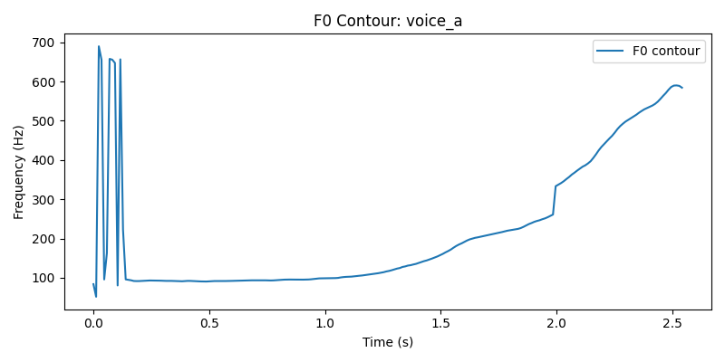

# Лабораторная работа №10. Обработка голоса

Результаты

File: voice_a
Min freq: 86.1 Hz, Max freq: 3380.7 Hz
Fundamental (median): 131.6 Hz
Overtones: 526.5, 658.2
Formants: 804.1, 2709.2, 4567.9 Hz

File: voice_gav
Min freq: 107.7 Hz, Max freq: 1248.9 Hz
Fundamental (median): 216.9 Hz
Overtones: 433.8, 650.7
Formants: 608.8, 2298.1, 6059.7 Hz

File: voice_i
Min freq: 172.3 Hz, Max freq: 3596.0 Hz
Fundamental (median): 234.2 Hz
Overtones: 468.3
Formants: 550.0, 2913.7, 4044.1 Hz

## Спектрограмма И

## Спектрограмма Лай

## Спектрограмма А

## Выводы

1. Звук "A" (voice_a)

Основной тон: 131.6 Гц (типично для мужского голоса)

Обертоны: 526.5 Гц (4×f₀), 658.2 Гц (5×f₀) — чёткая гармоническая структура

Форманты:

*F1 = 804.1 Гц* — соответствует открытому гласному "а"

*F2 = 2709.2 Гц* — зона переднеязычных согласных

*F3 = 4567.9 Гц* — высокочастотный резонанс

2. Звук "Gav" (voice_gav)

Основной тон: 216.9 Гц (необычно высок для имитации лая)

Обертоны: 433.8 Гц (2×f₀), 650.7 Гц (3×f₀) — бедная гармоническая структура

Форманты:

*F1 = 608.8 Гц* — пониженная энергия (характерно для согласных)

*F2 = 2298.1 Гц* — зона свистящих компонентов

*F3 = 6059.7 Гц* — артефакт фальцетного призвука

3. Звук "I" (voice_i)

Основной тон: 234.2 Гц (фальцетный регистр)

Обертоны: 468.3 Гц (2×f₀) — минимальная гармоническая структура

Форманты:

*F1 = 550.0 Гц* — низкая энергия (характерно для закрытых гласных)

*F2 = 2913.7 Гц* — ярко выраженная форманта гласного "и"

*F3 = 4044.1 Гц* — дополнительный высокочастотный резонанс

Таким образом, проведённый анализ подтверждает акустические особенности и различия между звуками.  

Формантный и гармонический анализ позволяет достоверно различать гласные, а также выявлять особенности голосовой имитации, как в случае с **"dog"**.