# Лабораторная работа: Обесцвечивание и бинаризация растровых изображений

## Описание

В данной лабораторной работе выполняется преобразование изображений в полутоновые и бинарные изображения с использованием различных методов бинаризации. Для выполнения задания использовались изображения из папки `pictures_scr`, а результаты обработки были сохранены в папку `pictures_results`.

## Примененные методы

1. **Приведение к полутоновому изображению**  
   Для каждого изображения был вычислен яркостный канал, который использовался для преобразования в полутоновое изображение.

2. **Бинаризация с использованием порога**  
   Для каждого полутонового изображения был применен пороговый метод, при котором пиксели, яркость которых выше порога, становились белыми, а ниже – черными.

3. **Адаптивная бинаризация Бернсена (окно 5x5)**  
   Для изображений с неравномерным освещением была использована адаптивная бинаризация Бернсена. Порог для каждого пикселя вычисляется как среднее значение между минимальным и максимальным значением яркости в окрестности (окно 5x5).

## Результаты

### Пример 1: Изображение дома 

#### Исходное изображение:

#### Полутоновое изображение:
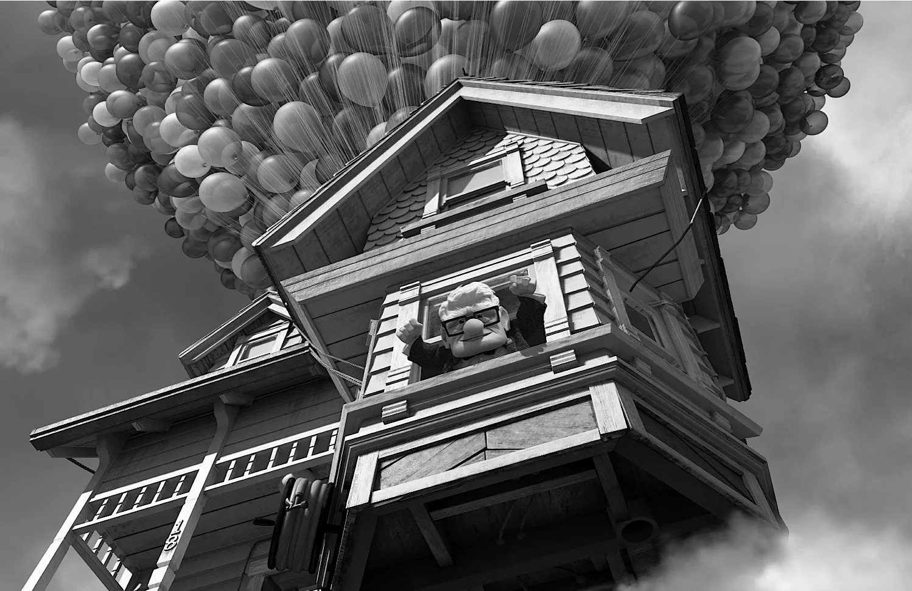

#### Бинаризация:
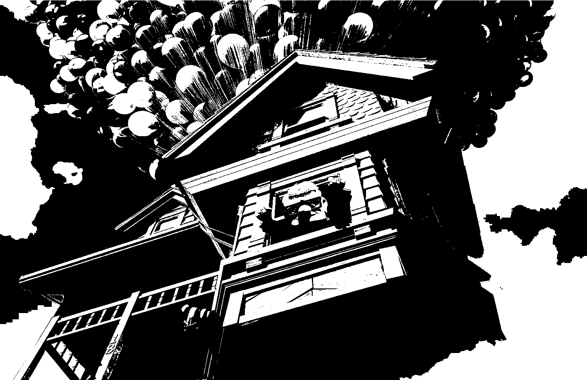

#### Адаптивная бинаризация Бредли-Рота  (Окно 5x5):
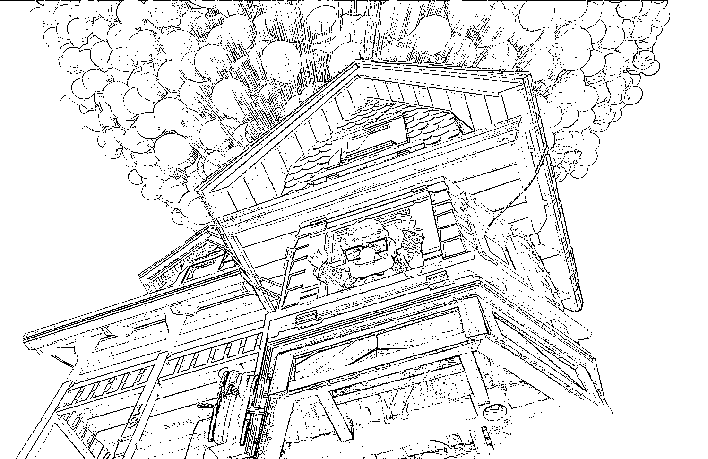

### Пример 2: Изображение карты 

#### Исходное изображение:

#### Полутоновое изображение:
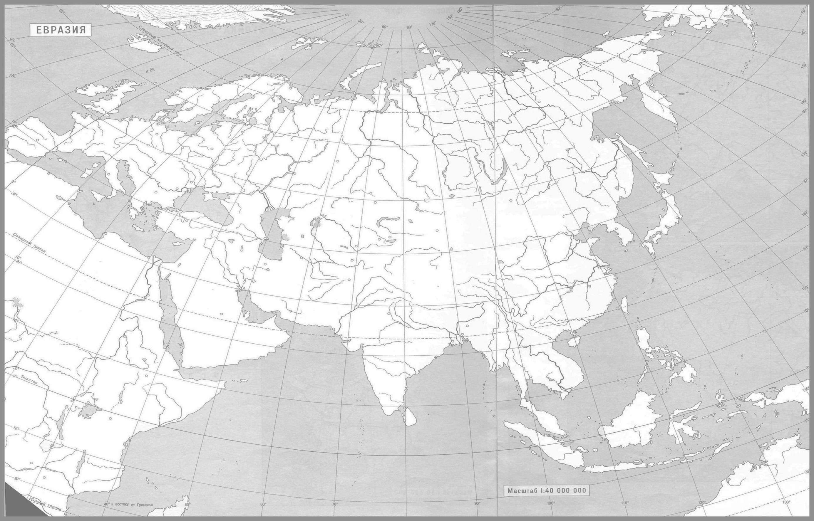

#### Бинаризация:
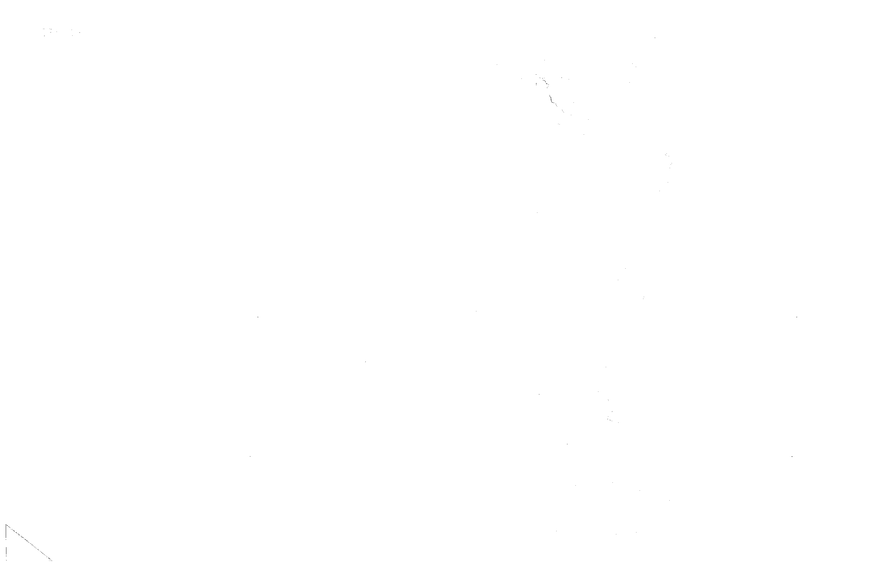

#### Адаптивная бинаризация Бредли-Рота (Окно 5x5):
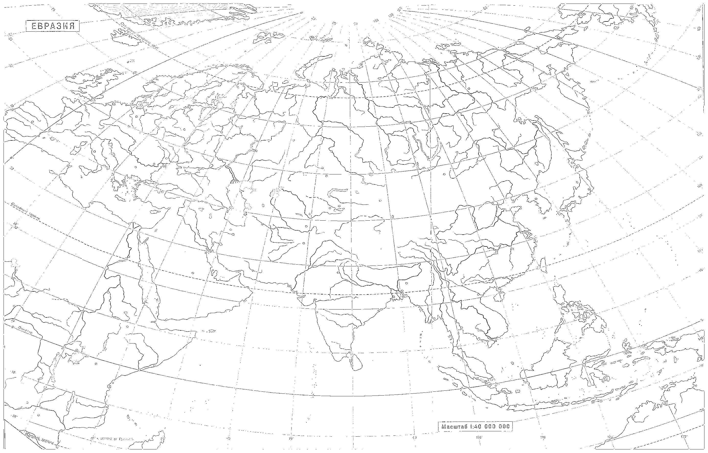

### Пример 3: Изображение Аниме

#### Исходное изображение:

#### Полутоновое изображение:
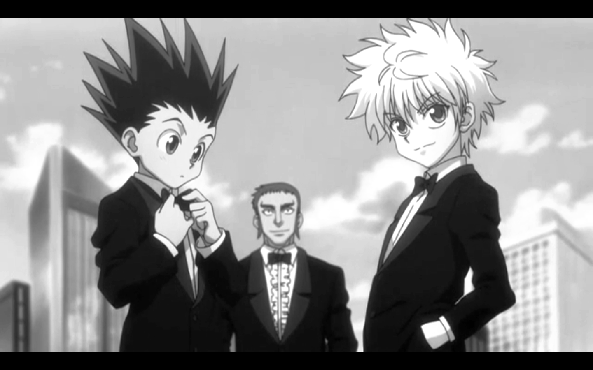

#### Бинаризация:
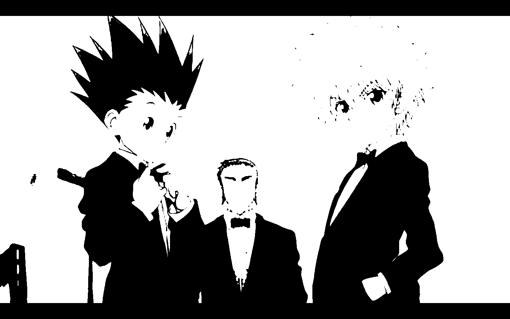

#### Адаптивная бинаризация Бредли-Рота (Окно 5x5):
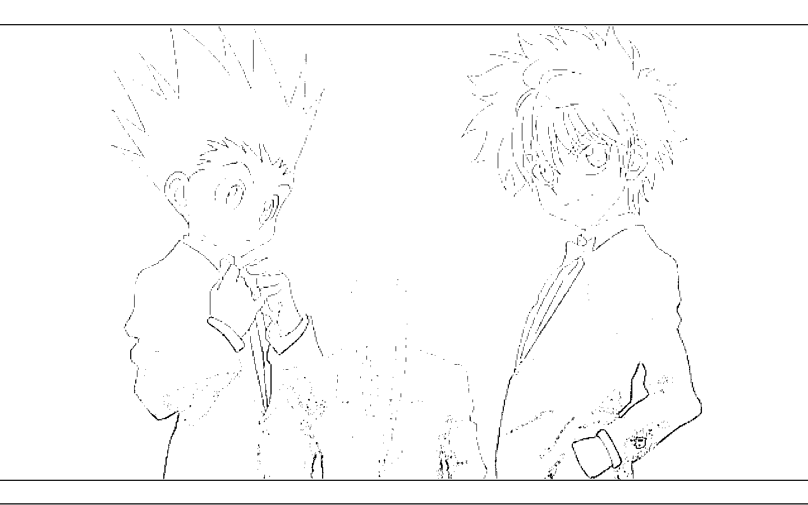

### Пример 4: Портрет 

#### Исходное изображение:

#### Полутоновое изображение:

#### Бинаризация:

#### Адаптивная бинаризация Бредли-Рота (Окно 5x5):
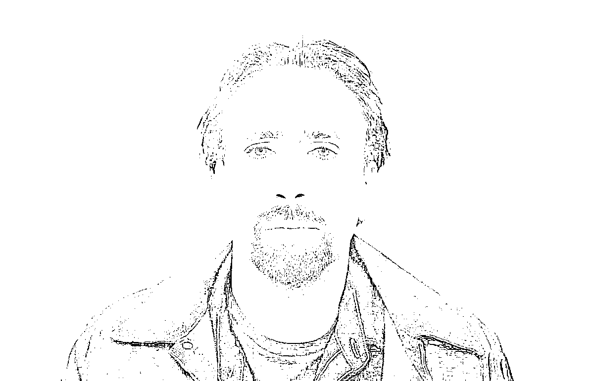

### Пример 5: Изображение Рентгена

#### Исходное изображение:
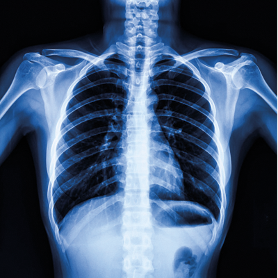

#### Полутоновое изображение:
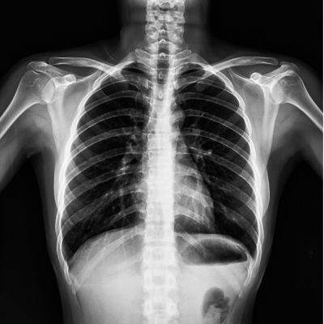

#### Бинаризация:
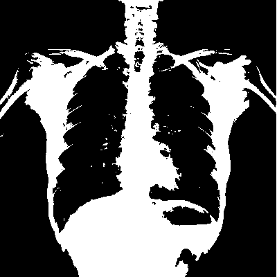

#### Адаптивная бинаризация Бредли-Рота (Окно 5x5):
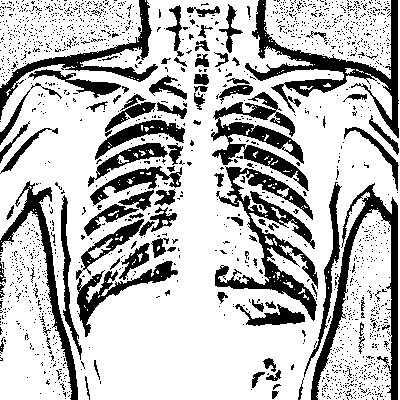

### Пример 6: Изображение Текста

#### Исходное изображение:
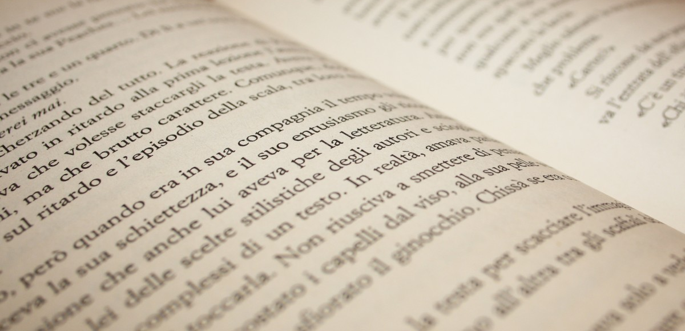

#### Полутоновое изображение:
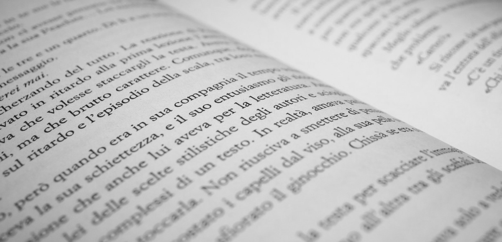

#### Бинаризация:
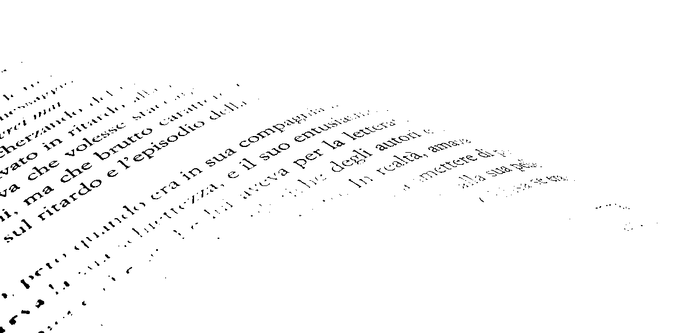

#### Адаптивная бинаризация Бредли-Рота (Окно 5x5):
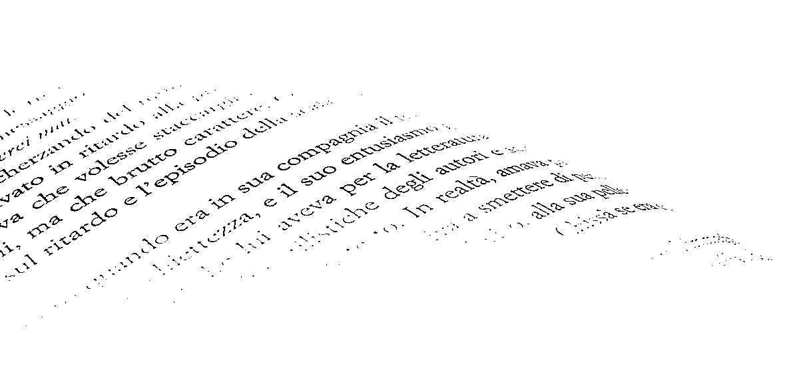

## Выводы по адаптивной бинаризации Бредли-Рота

### Плюсы:
- **Устойчивость к неравномерному освещению**: Метод адаптирует порог локально, анализируя среднюю яркость в окрестности каждого пикселя. Это позволяет эффективно обрабатывать изображения с перепадами освещения.
- **Оптимизация вычислений**: Использование интегрального изображения значительно ускоряет расчет среднего значения яркости в окне, делая алгоритм пригодным для обработки изображений среднего размера.

### Минусы:
- **Зависимость от размера окна**: Слишком большой размер окна может привести к потере мелких деталей, а слишком маленький — к избыточному шуму в результате бинаризации.
- **Чувствительность к текстурам**: В областях с плавными градиентами или сложными текстурами метод может создавать артефакты, особенно если средняя яркость окна близка к яркости пикселя.

## Заключение

Адаптивная бинаризация Брэдли-Рота — это надежный метод для обработки изображений с неравномерным освещением, особенно эффективный при выделении объектов на фоне с плавными изменениями яркости. Его ключевое преимущество — баланс между точностью и скоростью работы благодаря интегральным изображениям. Однако для достижения оптимальных результатов требуется тщательный подбор параметров (размера окна и коэффициента порога). На изображениях с шумом или слабым контрастом рекомендуется предварительно применять фильтрацию (например, медианную) или комбинировать метод с другими алгоритмами предобработки.