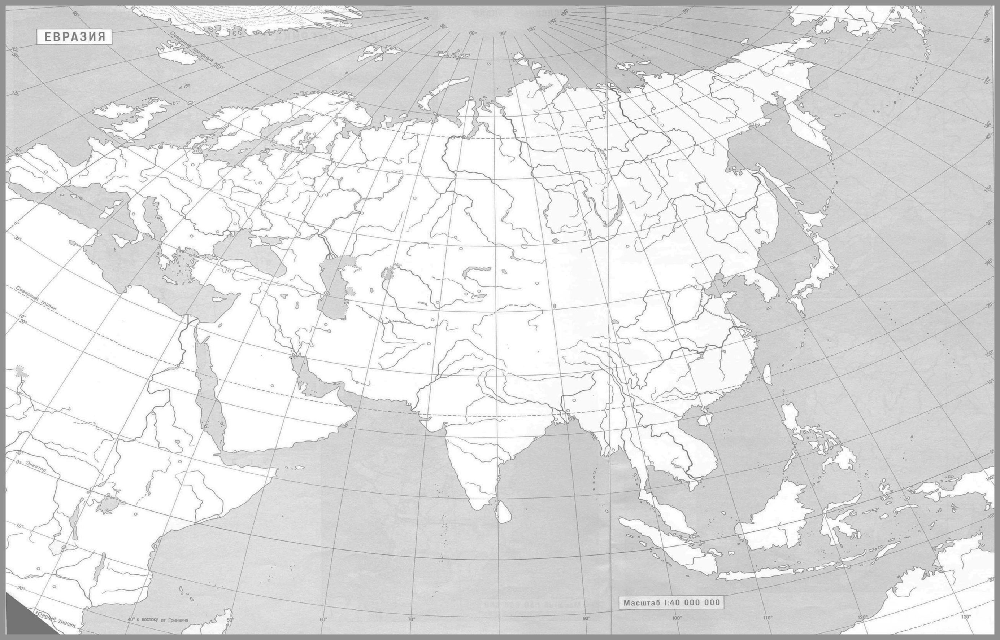

# Лабораторная работа №4: Выделение контуров на изображении

## Задание

В данной лабораторной работе требуется выполнить выделение контуров на изображении, используя **разность исходного и морфологически расширенного изображения**. Также необходимо вычислить градиент изображения по операторам Собеля. Для обработки используются изображения из папки `pictures_src`, а результаты сохраняются в `pictures_results`.

Задание состоит из следующих шагов:
1. Исходное цветное изображение.
2. Полутоновое изображение.
3. Три градиентные матрицы Gx, Gy, G, нормализованные так, чтобы значения яркости лежат от 0 до 255.
4. Морфологический градиент (разность исходного и расширенного изображения).
4. Бинаризованная градиентная матрица G, где порог подбирается опытным путём.

## Исходное изображение и результаты

### Пример 1:

**Исходное изображение:**

**Результаты:**

- **Полутоновое изображение:**

- **Градиент по оси X:**

- **Градиент по оси Y:**

- **Общий градиент:**

- **Морфологический  градиент:**

- **Бинаризованный градиент:**

### Пример 2:

**Исходное изображение:**

**Результаты:**

- **Полутоновое изображение:**

- **Градиент по оси X:**

- **Градиент по оси Y:**

- **Общий градиент:**

- **Морфологический градиент:**

- **Бинаризованный градиент G:**

### Пример 3:

**Исходное изображение:**

**Результаты:**

- **Полутоновое изображение:**

- **Градиент по оси X:**

- **Градиент по оси Y:**

- **Общий градиент:**

- **Морфологический градиент:**

- **Бинаризованный градиент G:**

### Пример 4:

**Исходное изображение:**

**Результаты:**

- **Полутоновое изображение:**

- **Градиент по оси X:**

- **Градиент по оси Y:**

- **Общий градиент:**

- **Морфологический градиент:**

- **Бинаризованный градиент G:**

## Вывод

В результате выполнения лабораторной работы была реализована методика выделения контуров с использованием **разности исходного и морфологически расширенного изображения**. Также были рассчитаны градиентные матрицы Gx, Gy и итоговый градиент G.  

Все результаты корректно сохранены, изображения показывают различия в методах обработки.  