# Лабораторная работа №5. Выделение признаков символов

## Символ - ა

### Фото прямой буквы
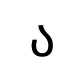

### Фото инвертированной буквы
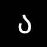

### Профили буквы

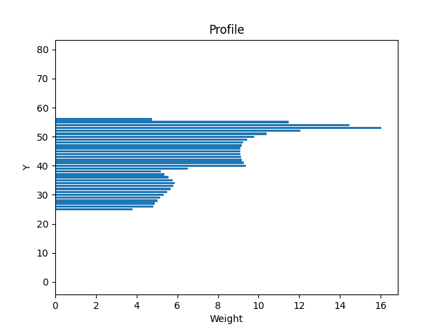

### Признаки:
1. Вес I - 7.780392156862745
2. Относительный вес I - 0.0048627450980392155
3. Вес II - 72.47843137254903
4. Относительный вес II - 0.04529901960784314
5. Вес III - 77.16078431372549
6. Относительный вес III - 0.04822549019607843
7. Вес IV - 93.87843137254902
8. Относительный вес IV - 0.05867401960784314
9. Общий вес - 251.2980392156863
10. Относительный общий вес - 0.03926531862745098
11. Центр тяжести Y - 43.251931149638736
12. Центр тяжести X - 42.419328662161945
13. Относительный центр тяжести Y - 0.5406491393704842
14. Относительный центр тяжести X - 0.5302416082770243
15. Момент инерции Y - 9706.1145863492
16. Момент инерции X - 19398.222837334244
17. Относительный момент инерции Y - 0.00023696568814329103
18. Относительный момент инерции X - 0.0004735894247396056

## Символ - ბ

### Фото прямой буквы
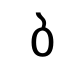

### Фото инвертированной буквы
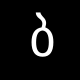

### Профили буквы
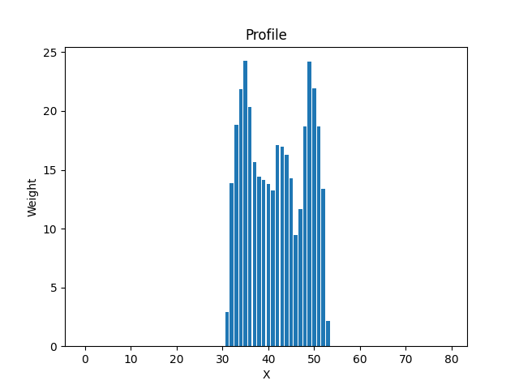
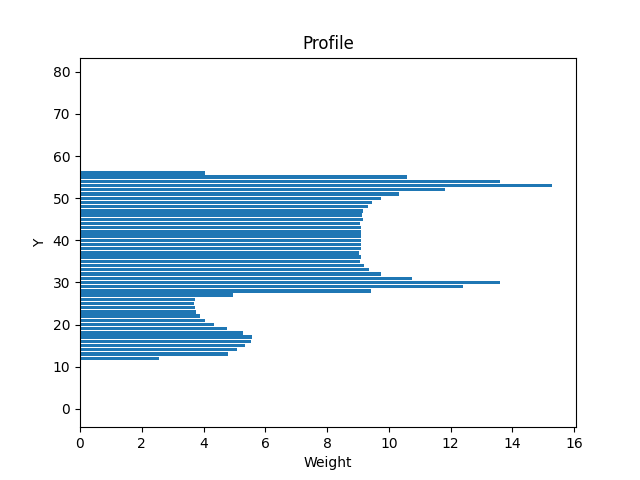

### Признаки:
1. Вес I - 71.72941176470589
2. Относительный вес I - 0.04483088235294118
3. Вес II - 119.17254901960784
4. Относительный вес II - 0.0744828431372549
5. Вес III - 74.51764705882353
6. Относительный вес III - 0.04657352941176471
7. Вес IV - 92.6156862745098
8. Относительный вес IV - 0.057884803921568626
9. Общий вес - 358.0352941176471
10. Относительный общий вес - 0.05594301470588236
11. Центр тяжести Y - 37.46329094513631
12. Центр тяжести X - 41.84750106791969
13. Относительный центр тяжести Y - 0.46829113681420387
14. Относительный центр тяжести X - 0.523093763348996
15. Момент инерции Y - 14422.759832818218
16. Момент инерции X - 51869.1204690299
17. Относительный момент инерции Y - 0.0003521181599809135
18. Относительный момент инерции X - 0.0012663359489509252

## Символ - გ

### Фото прямой буквы
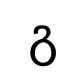

### Фото инвертированной буквы
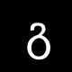

### Профили буквы

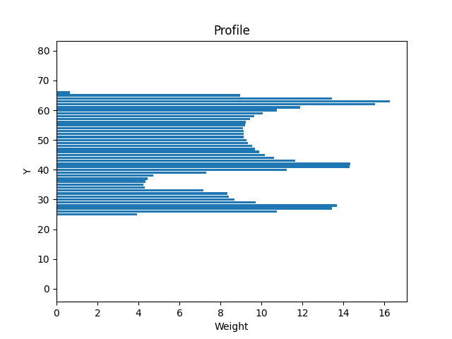

### Признаки:
1. Вес I - 35.72156862745098
2. Относительный вес I - 0.02232598039215686
3. Вес II - 77.73333333333333
4. Относительный вес II - 0.04858333333333333
5. Вес III - 120.56078431372549
6. Относительный вес III - 0.07535049019607844
7. Вес IV - 161.11764705882354
8. Относительный вес IV - 0.10069852941176471
9. Общий вес - 395.1333333333333
10. Относительный общий вес - 0.061739583333333334
11. Центр тяжести Y - 46.416856062485735
12. Центр тяжести X - 42.62654452703977
13. Относительный центр тяжести Y - 0.5802107007810717
14. Относительный центр тяжести X - 0.5328318065879971
15. Момент инерции Y - 21047.96958434502
16. Момент инерции X - 57848.09886926852
17. Относительный момент инерции Y - 0.0005138664449302983
18. Относительный момент инерции X - 0.001412307101300501

## Символ - დ

### Фото прямой буквы
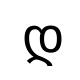

### Фото инвертированной буквы
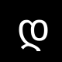

### Профили буквы
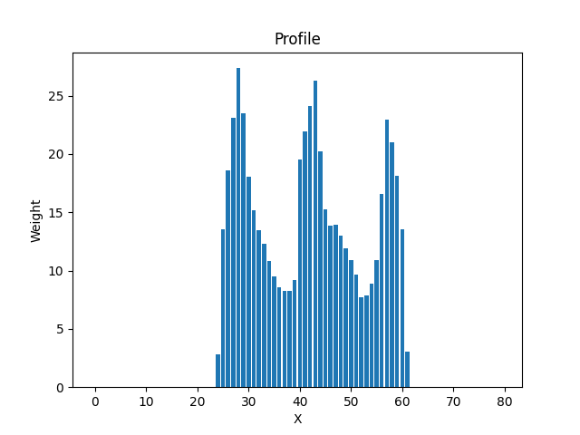

### Признаки:
1. Вес I - 94.07058823529412
2. Относительный вес I - 0.05879411764705883
3. Вес II - 150.07843137254903
4. Относительный вес II - 0.09379901960784315
5. Вес III - 128.41176470588235
6. Относительный вес III - 0.08025735294117647
7. Вес IV - 180.95686274509805
8. Относительный вес IV - 0.11309803921568629
9. Общий вес - 553.5176470588236
10. Относительный общий вес - 0.0864871323529412
11. Центр тяжести Y - 42.45046653488916
12. Центр тяжести X - 41.812365831367295
13. Относительный центр тяжести Y - 0.5306308316861145
14. Относительный центр тяжести X - 0.5226545728920912
15. Момент инерции Y - 65571.53998697229
16. Момент инерции X - 71948.67622266148
17. Относительный момент инерции Y - 0.0016008676754631908
18. Относительный момент инерции X - 0.0017565594780923214

## Символ - ე

### Фото прямой буквы
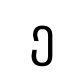

### Фото инвертированной буквы
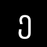

### Профили буквы
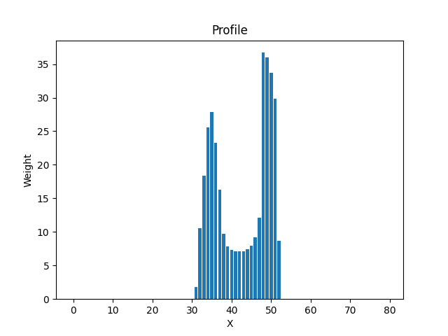
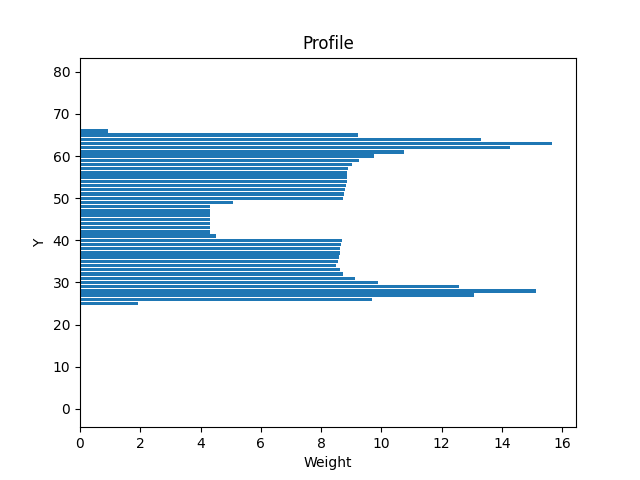

### Признаки:
1. Вес I - 60.490196078431374
2. Относительный вес I - 0.03780637254901961
3. Вес II - 79.82745098039216
4. Относительный вес II - 0.0498921568627451
5. Вес III - 80.57254901960785
6. Относительный вес III - 0.05035784313725491
7. Вес IV - 130.6313725490196
8. Относительный вес IV - 0.08164460784313725
9. Общий вес - 351.52156862745096
10. Относительный общий вес - 0.05492524509803921
11. Центр тяжести Y - 45.73646221468574
12. Центр тяжести X - 42.70164439188737
13. Относительный центр тяжести Y - 0.5717057776835717
14. Относительный центр тяжести X - 0.5337705548985922
15. Момент инерции Y - 16183.226578888769
16. Момент инерции X - 58859.37037999028
17. Относительный момент инерции Y - 0.0003950983051486516
18. Относительный момент инерции X - 0.0014369963471677315

## Вывод по работе
В ходе выполнения лабораторной работы были выделены признаки символов грузинского алфавита. Для каждого символа были рассчитаны вес, относительный вес, координаты центра тяжести, моменты инерции и их нормированные значения. Также были построены профили X и Y для каждого символа. Полученные данные могут быть использованы для дальнейшего анализа и классификации символов.
