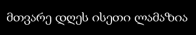

# Лабораторная работа №5. Сегментация текста

Лабораторная работа выполнена для:
    - Алфавит - грузинский
    - Шрифт - Arial
    - Размер шрифта - 40

## Сегментация символов

### Исходное изображение

### Выделенные символы в строке
                          
### Анализ

Можно заметить, что алгоритм не может нормально сегментировать грузинский алфавит. Это связано с тем, что все символы имеют разную длину. В связи с этим, данную проблему нужно будет решать уже при распознавании символов.

## Сегментация текстовой области

### Исходное изображение

### Сегментированное изображение

### Анализ

Алгоритм сегментации текстовой области выделяет текст на основе профилей, в связи с чем может появиться ненатурально "высокая" область, так как в профили будут попадать маленькие части текста, по типу верхушек некоторых букв.