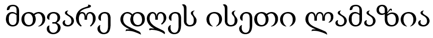
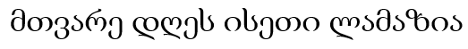

# Лабораторная работа №7. Классификация на основе признаков, анализ профилей

Лабораторная работа выполнена для:

- Алфавит - грузинский
- Тип букв - строчные 
- Шрифт - Times New Roman 
- Размер шрифта - 48 и 20

## Распознание символов того же шрифта

### Исходное изображение

### Классификация символов на основе известных признаков

Выводятся лучшие гипотезы

1: ('მ', 0.7667)
2: ('თ', 0.6779)
3: ('ვ', 0.7792)
4: ('ა', 0.6615)
5: ('რ', 0.6663)
6: ('ე', 0.6803)
7: ('დ', 0.7932)
8: ('ღ', 0.6152)
9: ('ე', 0.6803)
10: ('ს', 0.7304)
11: ('ი', 0.4094)
12: ('ს', 0.6022)
13: ('ე', 0.6955)
14: ('თ', 0.7533)
15: ('ი', 0.4282)
16: ('ლ', 0.6623)
17: ('ა', 0.6615)
18: ('მ', 0.7667)
19: ('ა', 0.6362)
20: ('ზ', 0.6348)
21: ('ი', 0.681)
22: ('ა', 0.6615)

### Результат

Распознано : მთვარე დღეს ისეთი ლამაზია
Эталон     : მთვარე დღეს ისეთი ლამაზია
Ошибок     : 0/25 | Точность: 100.00% 

## Распознание символов шрифта намного меньшего размера

### Исходное изображение

### Классификация символов на основе известных признаков

Выводятся лучшие гипотезы

1: ('ტ', 0.5253)
2: ('ი', 0.2546)
3: ('ყ', 0.4234)
4: ('ვ', 0.617)
5: ('ა', 0.4947)
6: ('რ', 0.5099)
7: ('ე', 0.466)
8: ('დ', 0.4836)
9: ('ღ', 0.4088)
10: ('ე', 0.5597)
11: ('ქ', 0.3782)
12: ('ჭ', 0.4736)
13: ('ჩ', 0.3932)
14: ('ყ', 0.3866)
15: ('ქ', 0.3664)
16: ('ჭ', 0.419)
17: ('ე', 0.6058)
18: ('ი', 0.3977)
19: ('ჭ', 0.4518)
20: ('ჩ', 0.4171)
21: ('ყ', 0.4144)
22: ('ღ', 0.346)
23: ('ყ', 0.4565)
24: ('ა', 0.4947)
25: ('ყ', 0.5846)
26: ('ა', 0.6163)
27: ('ზ', 0.57)
28: ('ჩ', 0.3876)
29: ('ჩ', 0.3668)
30: ('ა', 0.5401)

Распознано : ტიყვარედღექჭჩყქჭეიჭჩყღყაყაზჩჩა
Эталон     : მთვარე დღეს ისეთი ლამაზია
Ошибок     : 22/25 | Точность: 26.67%

Как можно заметить, для строк меньшего размера, анализ тоже работает, однако уже сложнее происходит сравнение с эталоном