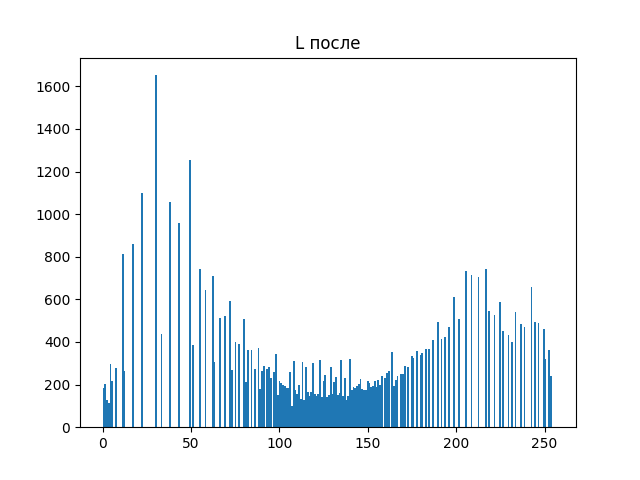

# Лабораторная работа №8. Текстурный анализ и контрастирование

* Матрица: NGLDM, 
* Параметры: d=1 
* Расчет признаков: NN, SM, ENT 
* Метод преобразования яркости: Выравнивание гистограммы

## Изображение 1

### Оригинал

### Полутон (L)

### Полутон после выравнивания

### Цвет после выравнивания

### Гистограмма яркости ДО

### Гистограмма яркости ПОСЛЕ

### Матрица NGLDM (отображение S)

### Текстурные признаки

| **Признак** | **До** | **После** |
|-------------|--------|-----------|
| **NN**      | 3.8737 | 1.9401    |
| **SM**      | 0.0714 | 0.1031    |
| **ENT**     | 5.5148 | 6.3638    |

## Изображение 2

### Оригинал

### Полутон (L)

### Полутон после выравнивания

### Цвет после выравнивания

### Гистограмма яркости ДО

### Гистограмма яркости ПОСЛЕ

### Матрица NGLDM (отображение S)

### Текстурные признаки

| **Признак** | **До** | **После** |
|-------------|--------|-----------|
| **NN**      | 4.8740 | 2.9283    |
| **SM**      | 0.0492 | 0.0982    |
| **ENT**     | 4.3506 | 5.6073    |

## Изображение 3

### Оригинал

### Полутон (L)

### Полутон после выравнивания

### Цвет после выравнивания

### Гистограмма яркости ДО

### Гистограмма яркости ПОСЛЕ

### Матрица NGLDM (отображение S)

### Текстурные признаки

| **Признак** | **До** | **После** |
|-------------|--------|-----------|
| **NN**      | 5.3416 | 4.3370    |
| **SM**      | 0.0373 | 0.0614    |
| **ENT**     | 6.2005 | 6.7413    |

## Выводы

Использование матрицы NGLDM и признаков NN, SM, ENT позволяет выявлять текстурные изменения при контрастировании яркости:

Снижение NN после выравнивания гистограммы означает, что соседние пиксели реже имеют ту же квантованную яркость. Это говорит об увеличении контрастов и "размытии" кластеров одинаковых тонов.

Увеличение SM отражает усиление выраженности текстур — различия между пикселями стали ярче, текстура стала более "агрессивной".

Рост ENT (энтропии) показывает увеличение разнообразия уровней — изображение стало информационно более насыщенным.

Таким образом, выравнивание гистограммы эффективно усиливает текстурные характеристики изображений, что подтверждается изменениями всех трёх признаков.