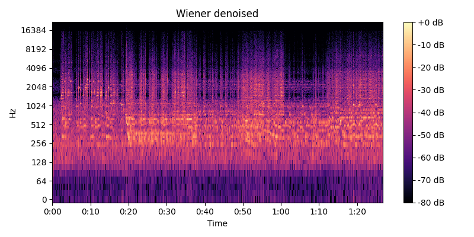

# Лабораторная работа №9. Анализ шума

Работа выполнялась для записи игры на фортепиано. Запись имела заметный фоновый шум. Построена спектрограмма, проведено устранение шума с помощью фильтра Винера и фильтра нижних частот (lowpass).

## Спектрограмма исходного звука

## Спектрограмма после фильтра Винера

## Спектрограмма после фильтра прохода lowpass

В спектрограммах видно, что после Wiener-фильтра уровень фонового шума снизился, но сохранились резкие переходы сигнала. Low-pass фильтр подчистил высокочастотный шум.

## Анализ пиков энергии

После обработки Wiener-фильтром были обнаружены следующие наиболее энергетически значимые точки:

- 15.052s @ 1894.9Hz — energy=12.86
- 6.885s @ 1981.1Hz — energy=11.41  
- 15.064s @ 1851.9Hz — energy=11.37
- 7.303s @ 1851.9Hz — energy=8.90
- 9.201s @ 2670.1Hz — energy=8.22
- 34.017s @ 1679.6Hz — energy=6.99
- 7.303s @ 1894.9Hz — energy=6.59
- 4.145s @ 1679.6Hz — energy=6.29
- 2.990s @ 2540.9Hz — energy=5.88
- 6.891s @ 2024.1Hz — energy=5.12

## Выводы

Wiener-фильтр хорошо подавляет стационарный шум, но не удаляет узкополосные «помехи» и может искажать фазу.

Анализ пиков энергии показывает, что наиболее значимые компоненты сигнала находятся в диапазоне 1600-2700 Гц.

Низкочастотный фильтр эффективно отсекает высокочастотный шум, оставляя основной диапазон музыкального инструмента, однако снижает детализацию.